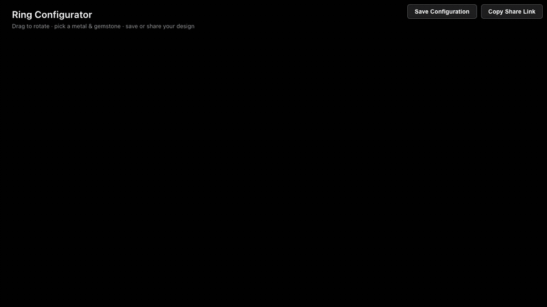

# 💍 Jewelry Configurator — Real-Time 3D Ring Simulator

A browser-based **3D jewelry configurator** built with React Three Fiber. Rotate a
photoreal diamond ring in real time, swap metals and gemstones, and watch physically
based refraction and lighting update instantly — then save the configuration or add it
to a cart.

> **Live demo:** _add Vercel/Netlify URL here after deploy_
> **Demo:** _add `docs/demo.gif` after recording_

<!--  -->

---

## ✨ What it does

- **Real-time 3D preview** — drag to orbit the ring with spring-damped
  `PresentationControls`; the camera feels weighty, not twitchy.
- **Physically based diamond** — `MeshRefractionMaterial` with chromatic aberration
  gives the gemstone true light refraction, not a fake shiny texture.
- **Live material swapping** — 3 metals (Gold, Rose Gold, Silver) × 6 gemstones
  (Topaz, Pink Sapphire, Diamond, Emerald, Ruby, Amethyst), applied instantly to the
  mesh materials via Redux state.
- **Studio lighting** — real HDRI environment map + `AccumulativeShadows` /
  `RandomizedLight` for soft contact shadows, finished with a `Bloom` post-process pass.
- **Save & cart** — persist configurations to Redux store and push the customized ring
  into the cart flow.

The repo also contains a full e-commerce scaffold (product list, cart, checkout,
auth, user profile) the simulator is embedded in — but **the configurator is the
centerpiece**.

## 🛠️ Tech stack

| Area | Tools |
|------|-------|
| 3D / rendering | `three`, `@react-three/fiber`, `@react-three/drei`, `@react-three/postprocessing` |
| State | Redux Toolkit |
| Animation | GSAP, react-spring |
| UI / forms | React 18, react-hook-form, zod, react-router-dom |
| Language | TypeScript |

## 🚀 Run locally

```bash
npm install
# CRA + Node 17+ needs the legacy OpenSSL provider:
NODE_OPTIONS=--openssl-legacy-provider npm start
```

Open http://localhost:3000 and head to the **Simulator** page.

Build for production:

```bash
NODE_OPTIONS=--openssl-legacy-provider npm run build
```

## 🧩 How the simulator works

1. `Simulator3D.tsx` sets up the `<Canvas>`, HDRI environment, shadows and bloom.
2. `ring.tsx` loads `ring-transformed.glb`, splitting it into a `ring` mesh and a
   `diamonds` mesh so each can take its own material/color.
3. Metal and gemstone buttons dispatch `setRingColor` / `setDiamondColor`; the
   `configurationReducer` holds `currentConfig` + `savedConfigurations`.
4. A `useEffect` in `ring.tsx` writes the selected colors straight onto the GLTF
   materials, so changes show up the next frame.

## 🗺️ Roadmap

- [ ] Shareable configuration links (encode metal + gemstone in the URL)
- [ ] AR preview (`<model-viewer>` / WebXR)
- [ ] Migrate CRA → Vite for faster builds and a maintained toolchain
- [ ] More ring models + adjustable stone size

## 📄 License

MIT
